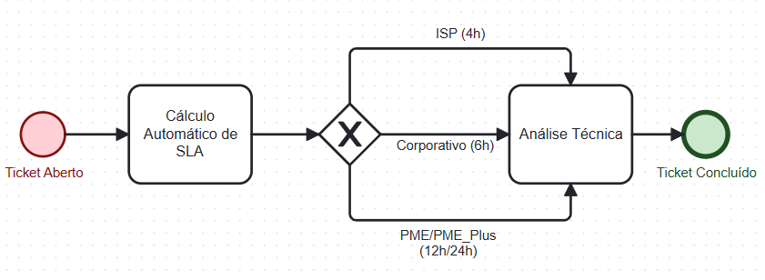
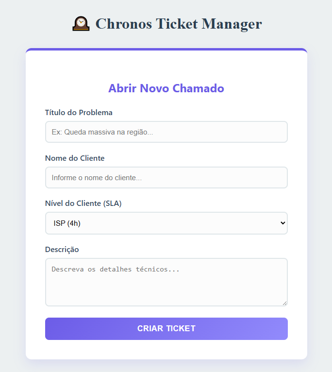
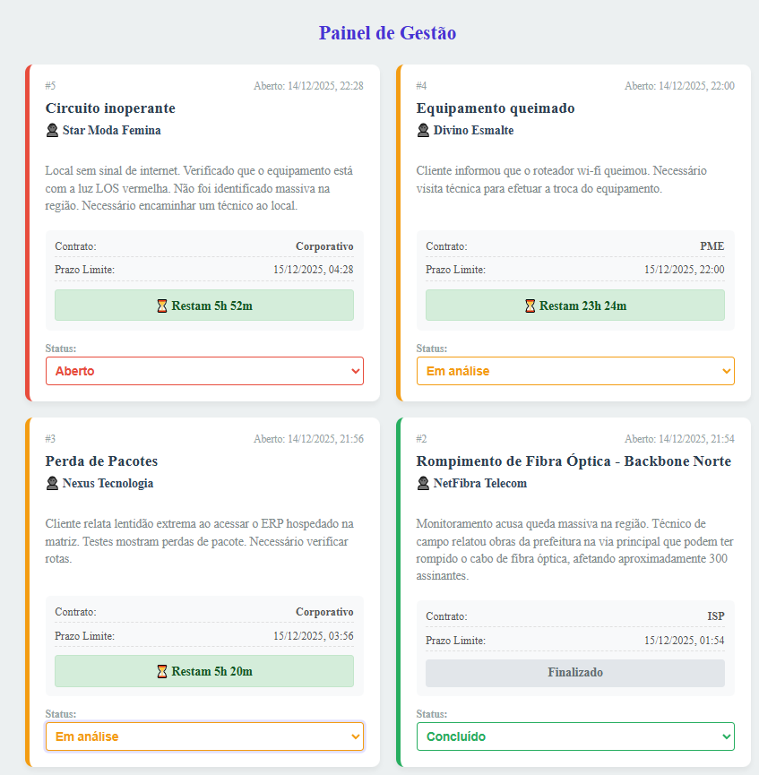

# 🕰️ Chronos Ticket Manager

> Sistema Full Stack de Gestão de Chamados com cálculo automatizado de SLA via Banco de Dados.


## 📖 Sobre o Projeto

O **Chronos Ticket Manager** é uma aplicação desenvolvida para gerenciar tickets de suporte em provedores de internet e empresas de TI. 

O diferencial deste projeto é a arquitetura orientada a dados: **o cálculo do SLA (Service Level Agreement) não é feito no código da aplicação, mas sim diretamente no Banco de Dados** através de Triggers e Functions em PL/pgSQL. Isso garante integridade, performance e centralização da regra de negócio.

### 🎯 Funcionalidades Atuais

- **Abertura de Chamados:** Cadastro com validação de campos.
- **Cálculo Automático de SLA:** O sistema define o prazo de atendimento baseado no nível de contrato do cliente (ISP, Corporativo, PME).
- **Dashboard em Tempo Real:** Visualização de tickets com contagem regressiva e alertas visuais de SLA estourado.
- **Update de Status:** Atualização dinâmica (Aberto -> Em Análise -> Concluído).

---

## 🔮 Próximos Passos (Roadmap)

O projeto está em evolução constante. As seguintes funcionalidades estão planejadas para as próximas versões (v2.0):

- [ ] **Autenticação de Usuários:** Implementação de tela de Login e segurança com JWT (JSON Web Tokens).
- [ ] **Controle de Acesso (RBAC):** Diferenciação de níveis de acesso (Admin, Técnico e Cliente) para restringir funcionalidades sensíveis.
- [ ] **Gestão de Base de Clientes:** Criação de tabela dedicada para clientes, permitindo seleção via lista (e não digitação manual) e histórico por cliente.
- [ ] **Roteamento no Frontend:** Implementação do **React Router** para separar a tela de "Abertura de Chamados" da tela de "Gestão/Dashboard".
- [ ] **Sistema de Anotações (Follow-up):** Funcionalidade para técnicos inserirem comentários e atualizações de andamento dentro de um ticket aberto (Histórico de atendimento).
---

## 🏗️ Arquitetura e Fluxo de Dados

A lógica de negócio segue o fluxo BPMN abaixo, onde a decisão do prazo é tomada pela engine do PostgreSQL:



---

## 🛠️ Tecnologias Utilizadas

### Linguagem Principal
- **JavaScript (ES6+):** Utilizado em todo o stack (Full Stack). Aplicação de conceitos modernos como **Async/Await**, **Arrow Functions**, **Destructuring** e manipulação de **DOM/Estado**.

### Frontend
- **React.js (Vite):** Criação de interfaces reativas e rápidas.
- **Fetch API:** Integração assíncrona com o Backend.

### Backend
- **Node.js & Express:** Construção de API RESTful escalável.
- **PostgreSQL:** Banco relacional com PL/pgSQL Triggers para automação de regras de negócio.

---

## 📸 Screenshots

- **FORMULÁRIO DE ABERTURA DE CHAMADOS:**

  


- **PAINEL DE GESTÃO:**

  
---

## 🚀 Como Executar o Projeto

Este projeto utiliza uma arquitetura de **Monorepo** (Backend e Frontend na mesma estrutura).

### Pré-requisitos
- Node.js instalado.
- PostgreSQL instalado e rodando.

### 1. Configuração do Banco de Dados
Execute o script SQL localizado em `chronos-backend/database/init.sql` no seu pgAdmin ou terminal psql para criar as tabelas, tipos ENUM e a Trigger de SLA.

### 2. Configuração do Backend
```bash
# Entre na pasta do backend
cd chronos-backend

# Instale as dependências
npm install

# Crie um arquivo .env na raiz de /chronos-backend com suas credenciais:
# DB_USER=seu_usuario
# DB_HOST=localhost
# DB_DATABASE=chronos_ticket_manager
# DB_PASSWORD=sua_senha
# DB_PORT=5432
# PORT=3000

# Inicie o servidor
node src/app.js
``` 

### 3. Configuração do Frontend
Abra um novo terminal
```
# Entre na pasta do frontend
cd chronos-frontend

# Instale as dependências
npm install

# Inicie o React
npm run dev
```
O projeto estará rodando em http://localhost:5173.

---

Feito com 💜 por Luana Mitre!

<p align="left">
  <a href="https://www.linkedin.com/in/luana-mitre/" target="_blank"></a>
  <a href="https://github.com/LuuhMitre" target="_blank">
    
  </a>
  <a href="https://my-portfolio-jet-one-93.vercel.app/" target="_blank">
    
  </a>
</p>